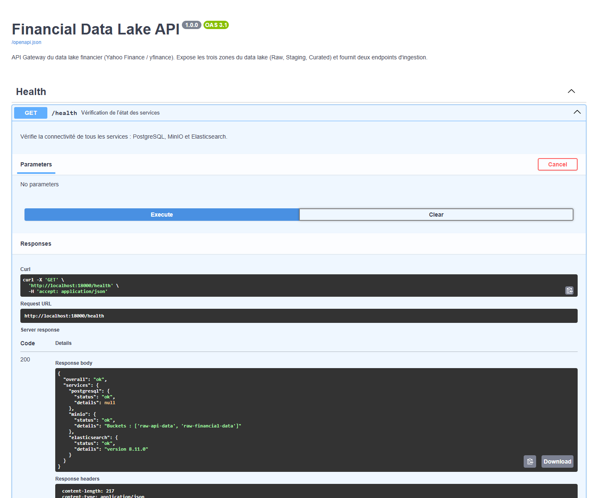
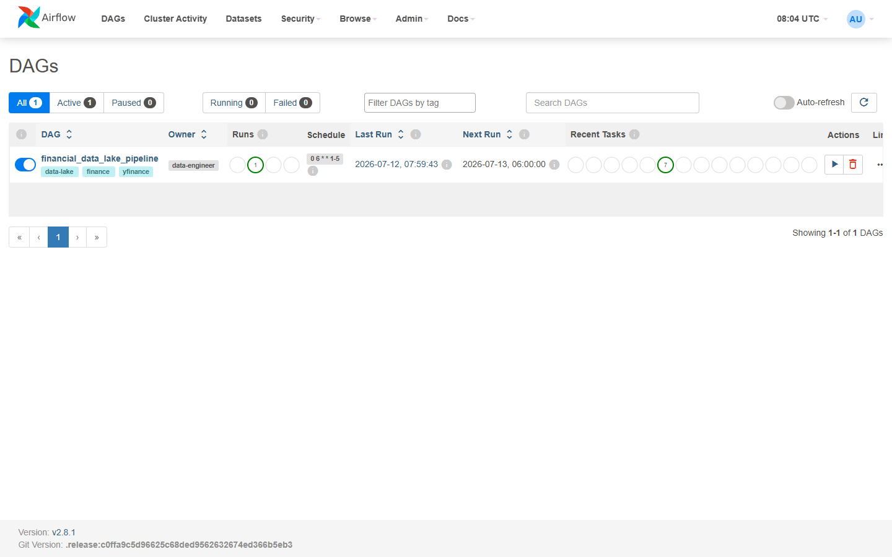
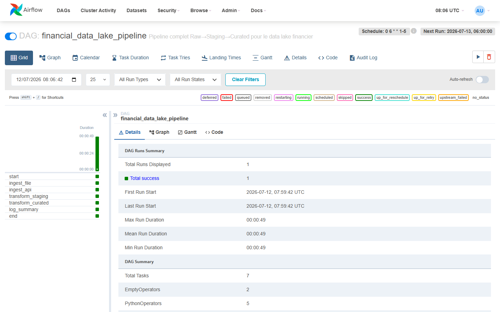
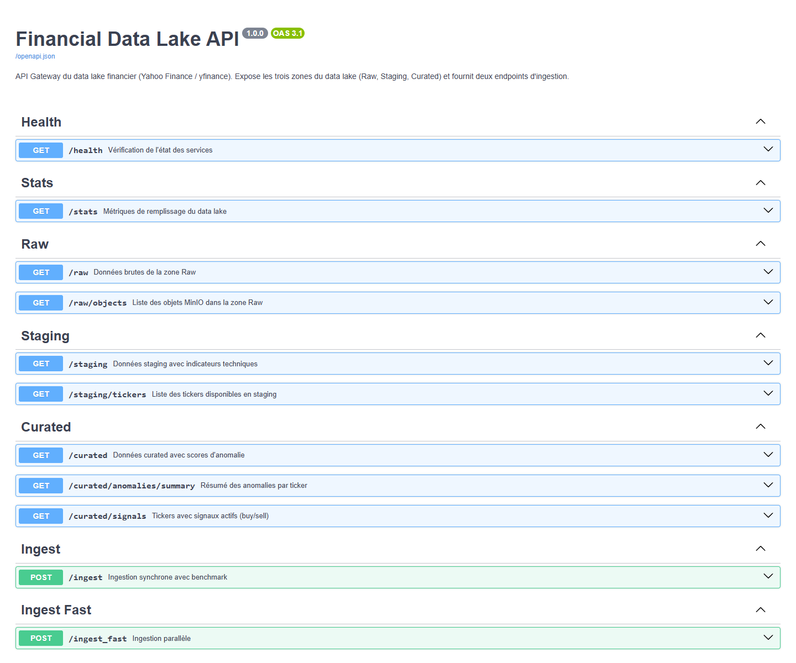
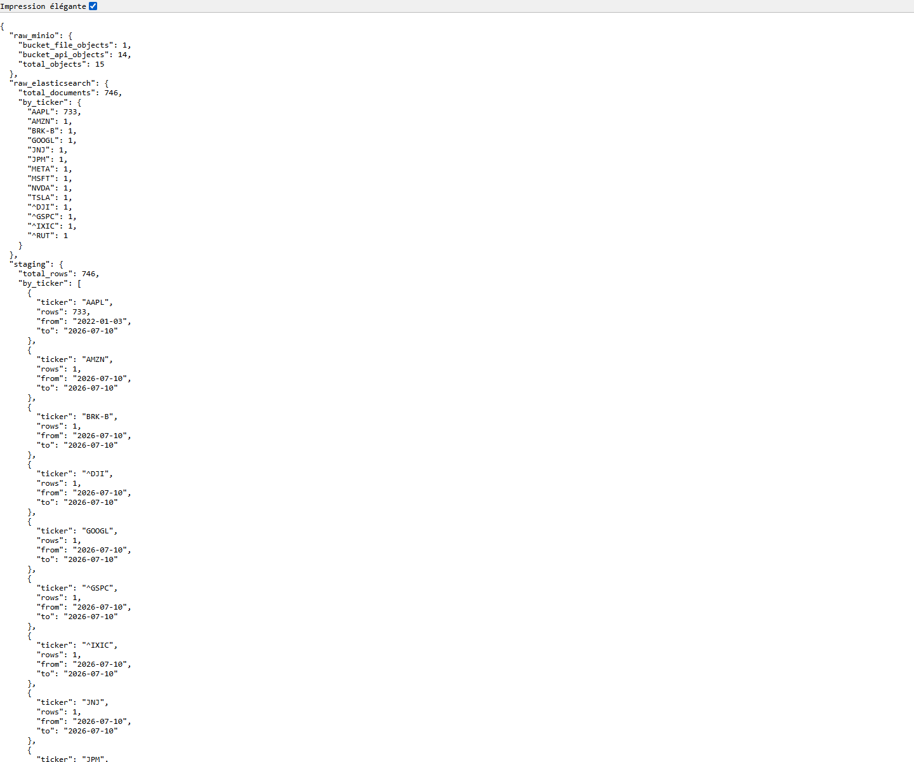
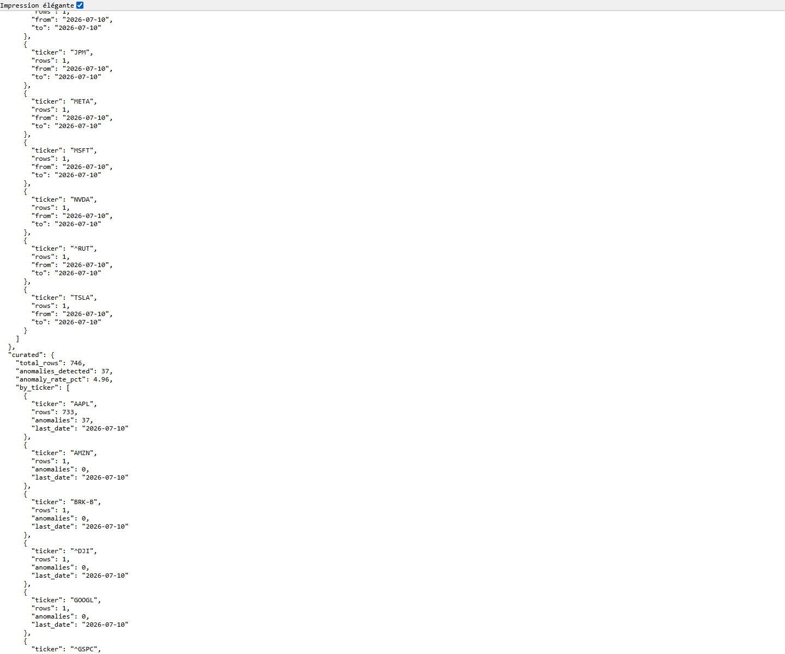
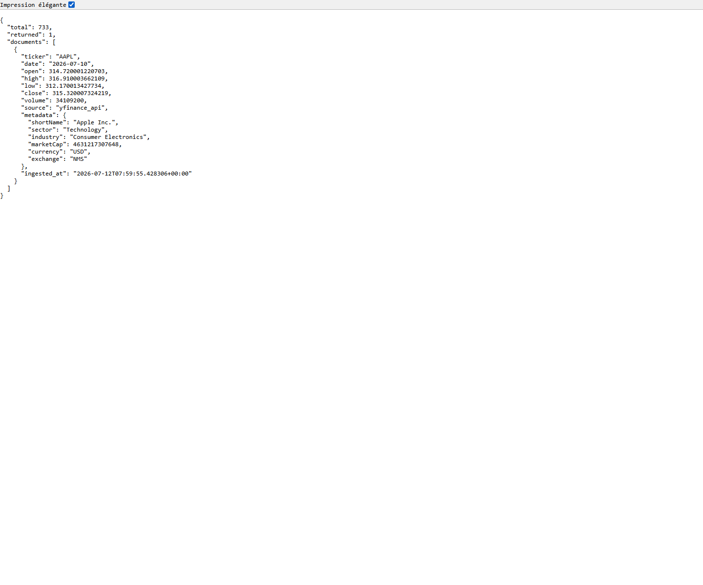
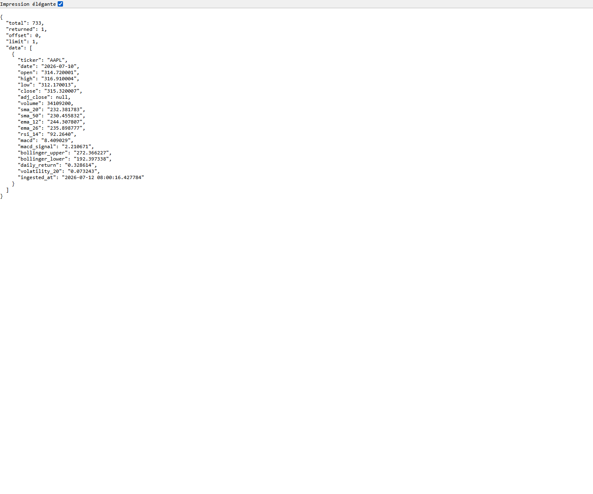
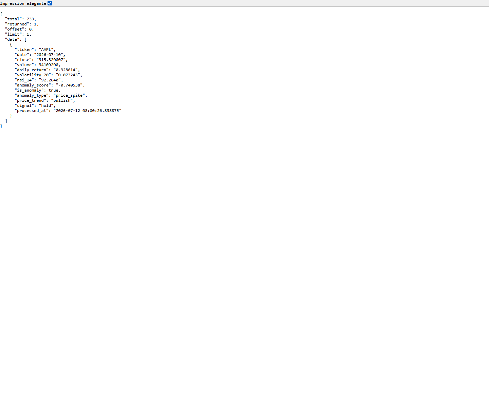

# Data Lake financier

Projet final du cours Data Lakes & Data Integration, EFREI 2025-2026.

Auteurs : Artemiy Smogunov, Nathan Smadja-Tubiana et Patrice Ignongui.

Le projet collecte des cours financiers depuis un fichier CSV versionné et depuis Yahoo Finance. Airflow orchestre les ingestions et les transformations. MinIO, Elasticsearch et PostgreSQL stockent les données. FastAPI permet ensuite de consulter chaque zone et de lancer une ingestion manuelle.

Le sujet d'origine est conservé dans `consignes/Data_Lakes_Projet_Final_EFREI_2025-2026.pdf`.

## Flux de données

```text
data/finance_dataset.csv ----|
                             |--> Raw --> Staging --> Curated --> FastAPI
Yahoo Finance ---------------|
                                  Airflow orchestre le pipeline
```

La zone Raw conserve ce qui vient des sources. Les fichiers et payloads sont écrits dans MinIO. Les lignes financières sont aussi indexées dans Elasticsearch pour pouvoir être recherchées.

La zone Staging rassemble les données par ticker et par date dans PostgreSQL. Elle retire les doublons, normalise les types et calcule les indicateurs techniques.

La zone Curated reprend chaque ligne Staging. Elle ajoute le score d'anomalie, le type d'anomalie, la tendance et un signal technique.

## Données utilisées

La source fichier est `data/finance_dataset.csv`. Elle contient 732 cours journaliers AAPL, du 3 janvier 2022 au 29 novembre 2024. Le fichier ne contient ni valeur manquante ni doublon sur la clé `(ticker, date)`.

La source API utilise `yfinance`. Le DAG interroge dix actions et quatre indices : AAPL, MSFT, GOOGL, AMZN, NVDA, META, TSLA, BRK-B, JPM, JNJ, ^GSPC, ^DJI, ^IXIC et ^RUT.

## Prérequis

Le lancement complet demande :

- Docker avec Docker Compose ;
- `uv` pour l'environnement Python local ;
- au moins 4 Go de mémoire disponibles pour les conteneurs.

Le projet utilise Python 3.11. Le fichier `.python-version` fixe cette version et `uv.lock` fixe toutes les dépendances Python résolues.

Vérification des outils :

```bash
docker --version
docker compose version
uv --version
```

## Installation de l'environnement Python

Depuis la racine du dépôt :

```bash
uv sync --frozen --all-groups
```

Cette commande crée `.venv` et installe les dépendances métier, FastAPI, les tests et ReportLab. Il n'est pas nécessaire d'activer manuellement l'environnement. Les commandes suivantes passent par `uv run`.

Pour vérifier le verrou et lancer les tests :

```bash
uv lock --check
uv run pytest -q
```

Résultat de la validation du 12 juillet 2026 : 14 tests réussis. La suite teste les indicateurs, le rendement journalier, le RSI, les tendances, les signaux, le chargement du CSV, la déduplication, les identifiants Raw, l'indexation simulée et le calcul du benchmark. Elle ne remplace pas le test d'intégration Docker décrit plus bas.

## Lancement avec Docker Compose

```bash
docker compose up -d --build
```

Le premier lancement construit deux images locales : une image FastAPI et une image Airflow. Les dépendances métier sont tirées du même `uv.lock`. Airflow conserve trois bibliothèques internes à sa version contrainte, puis vérifie l'environnement avec `pip check` pendant le build.

Contrôle des conteneurs :

```bash
docker compose ps -a
```

Les services attendus sont :

- PostgreSQL 15 sur le port 5432 ;
- MinIO sur les ports 9000 et 9001 ;
- Elasticsearch 8.11.0 sur le port 9200 ;
- Airflow 2.8.1 sur le port 8080 ;
- FastAPI sur le port 8000.

`airflow-init` et `minio-init` doivent être terminés avec le code 0. Les autres services doivent être actifs. Le Webserver Airflow, PostgreSQL, MinIO et Elasticsearch disposent d'un contrôle de santé.

## Vérification de la stack

```bash
curl http://localhost:8000/health
curl http://localhost:8000/stats
```

`/health` teste réellement la connexion à PostgreSQL, MinIO et Elasticsearch. Un résultat `overall: ok` signifie que les trois connexions ont réussi et que les deux buckets MinIO existent.



Cette capture vient de la stack de validation. Le code HTTP est 200. PostgreSQL, MinIO et Elasticsearch sont tous en état `ok`. La capture utilise le port 18000 parce qu'une autre stack occupait le port 8000 sur la machine de test. Le fichier Docker Compose du dépôt publie bien l'API sur le port 8000 lors d'un lancement normal.

## Interfaces locales

- Swagger : http://localhost:8000/docs
- Airflow : http://localhost:8080
- Console MinIO : http://localhost:9001
- Elasticsearch : http://localhost:9200

Les identifiants locaux sont `admin` / `admin` pour Airflow et `minioadmin` / `minioadmin` pour MinIO. Ils sont prévus pour l'environnement pédagogique local.

## Pipeline Airflow

Le DAG s'appelle `financial_data_lake_pipeline`. Son planning est `0 6 * * 1-5`, soit 6 h UTC du lundi au vendredi. Airflow crée le DAG en pause. Il faut donc l'activer avant le premier déclenchement.

```bash
docker compose exec airflow-webserver airflow dags unpause financial_data_lake_pipeline
docker compose exec airflow-webserver airflow dags trigger financial_data_lake_pipeline
docker compose exec airflow-webserver airflow dags list-runs -d financial_data_lake_pipeline
```

Ordre des tâches :

```text
start
  |-- ingest_file --|
  |                 |--> transform_staging --> transform_curated --> log_summary --> end
  |-- ingest_api  --|
```

Les deux ingestions commencent en parallèle. Staging attend leur fin. Curated attend Staging. La tâche `log_summary` écrit le nombre de succès, d'erreurs, de lignes traitées et d'anomalies dans les logs Airflow.



La liste contient un seul DAG actif. Elle montre son propriétaire, son planning et la date du dernier run. Le compteur `Failed` vaut zéro lors de la capture.



La vue Grid correspond au run `documentation_verified_20260712T075000Z`. Les sept tâches sont terminées avec le statut `success`. Le run a duré 49,3 secondes, du 12 juillet 2026 à 07:59:42 UTC jusqu'à 08:00:31 UTC.

## Routes FastAPI



Swagger enregistre onze routes métier :

- `GET /health` contrôle les stockages ;
- `GET /stats` donne les volumes des trois zones ;
- `GET /raw` interroge Elasticsearch ;
- `GET /raw/objects` liste les objets MinIO ;
- `GET /staging` lit les lignes transformées ;
- `GET /staging/tickers` liste les tickers et leurs périodes ;
- `GET /curated` lit les lignes enrichies ;
- `GET /curated/anomalies/summary` regroupe les anomalies ;
- `GET /curated/signals` retourne les signaux `buy` et `sell` ;
- `POST /ingest` lance l'ingestion manuelle séquentielle ;
- `POST /ingest_fast` lance l'ingestion manuelle parallèle.

Exemples de lecture :

```bash
curl "http://localhost:8000/raw?ticker=AAPL&limit=1"
curl "http://localhost:8000/staging?ticker=AAPL&limit=1"
curl "http://localhost:8000/curated?ticker=AAPL&limit=1"
curl "http://localhost:8000/curated/anomalies/summary"
```

Exemple d'ingestion manuelle :

```bash
curl -X POST http://localhost:8000/ingest_fast \
  -H "Content-Type: application/json" \
  -d '{"data":{"tickers":["AAPL","MSFT"],"period":"3mo","run_staging":true,"run_curated":true}}'
```

Les deux routes manuelles acceptent au maximum 200 tickers. Elles utilisent la source Elasticsearch `yfinance_manual`. Le mode rapide utilise huit threads pour les téléchargements et les envois MinIO, un bulk Elasticsearch pour tout le lot et `execute_values` pour PostgreSQL.

## Résultat du run vérifié

Le 12 juillet 2026, nous avons supprimé les volumes de validation, reconstruit les images, démarré la stack et déclenché le DAG avec l'identifiant `documentation_verified_20260712T075000Z`.

Le résumé Airflow indique :

- une ingestion fichier réussie, sans erreur ;
- quatorze ingestions API réussies, sans erreur ;
- 746 lignes traitées dans Staging ;
- 746 lignes traitées dans Curated ;
- 37 anomalies détectées.

Après le run, MinIO contient un objet CSV et quatorze objets API. Elasticsearch contient 746 documents. PostgreSQL contient 746 lignes Staging et 746 lignes Curated. Le taux global d'anomalies est de 4,96 %.



La première partie de `/stats` montre 15 objets MinIO, 746 documents Elasticsearch et 746 lignes Staging. AAPL possède 733 lignes. Les treize autres tickers possèdent une ligne récente chacun.



La partie Curated contient également 746 lignes. Les 37 anomalies appartiennent à AAPL, seul ticker qui possède assez d'historique pour lancer Isolation Forest dans ce run.

## Passage d'une ligne dans les trois zones

Les trois captures suivantes suivent AAPL au 10 juillet 2026.



Raw conserve le cours reçu de Yahoo Finance, le volume, les métadonnées de l'entreprise, la source et l'heure d'ingestion.



Staging ajoute les moyennes mobiles, les moyennes exponentielles, le RSI, le MACD, les bandes de Bollinger, le rendement journalier et la volatilité.



Curated classe cette ligne comme `price_spike`, avec une tendance `bullish` et un signal `hold`. Le rendement journalier calculé vaut 32,86 %. Ce résultat ne correspond pas à une hausse entre deux jours consécutifs. Le fichier CSV s'arrête au 29 novembre 2024 et la ligne API suivante date du 10 juillet 2026. Le calcul compare ces deux dates éloignées. Cette discontinuité est une limite réelle du dataset actuel.

## Arrêt et remise à zéro

Arrêt sans supprimer les données :

```bash
docker compose down
```

Suppression des conteneurs et des volumes :

```bash
docker compose down -v
```

La seconde commande efface les données PostgreSQL, MinIO, Elasticsearch et les logs Airflow de l'environnement Docker local.

## Documentation du projet

- `docs/GUIDE_UTILISATION.md` explique chaque commande et chaque interface ;
- `livrables/RAPPORT_TECHNIQUE.md` décrit l'architecture et les traitements ;
- `docs/CONFORMITE_DEVOIR.md` relie l'implémentation au sujet ;
- `data/README.md` décrit le CSV versionné ;
- `docs/captures/` contient les preuves de l'exécution finale.

Régénération des PDF :

```bash
uv run --group docs python scripts/generate_pdf_deliverables.py
```

## Limites constatées

- Yahoo Finance est une source externe. Le nombre de lignes récentes et le temps de réponse peuvent changer.
- Le CSV AAPL se termine en 2024. Le premier point API de 2026 crée une rupture temporelle dans les indicateurs fondés sur la ligne précédente.
- Isolation Forest ne s'exécute pas sous 30 lignes pour un ticker.
- Le paramètre de contamination est fixé à 5 %. Il influence directement le nombre d'anomalies.
- Les signaux `buy`, `sell` et `hold` sont des sorties techniques du projet. Ils ne constituent pas des recommandations financières.
- Les identifiants locaux et le CORS ouvert à toutes les origines ne conviennent pas à une exposition publique.
- Le code utilitaire reste organisé dans les dossiers `config`, `ingestion` et `transformation`. Il n'a pas été déplacé dans un package `src` dans cette version.
