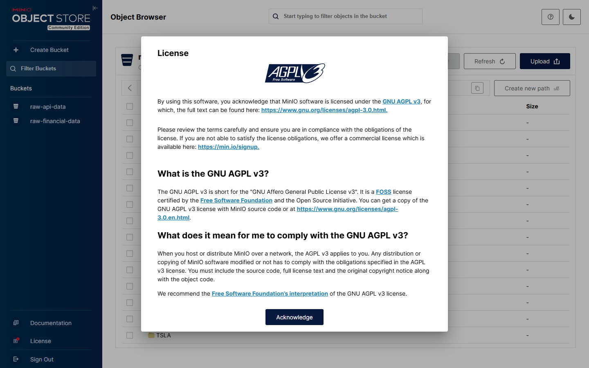

# Guide d'installation et d'utilisation

Ce guide part d'un clone neuf du dépôt. À la fin, la stack doit être active, le DAG doit avoir terminé et les trois zones doivent être consultables avec FastAPI.

## 1. Vérifier les prérequis

```bash
docker --version
docker compose version
uv --version
```

Le projet utilise Python 3.11. `uv` lit cette version dans `.python-version`. S'il ne trouve pas Python 3.11 sur la machine, il peut télécharger une version gérée dans son propre cache.

## 2. Créer l'environnement Python

Depuis la racine du dépôt :

```bash
uv sync --frozen --all-groups
```

`--frozen` interdit à `uv` de modifier le verrou pendant l'installation. `--all-groups` installe les groupes API, tests et documentation en plus des dépendances du pipeline.

Contrôles :

```bash
uv lock --check
uv run python --version
uv run pytest -q
```

La validation finale retourne `14 passed`. Un avertissement pandas annonce que PyArrow deviendra obligatoire dans pandas 3.0. Le projet utilise pandas 2.2.0 et n'appelle pas PyArrow, cet avertissement n'empêche donc aucun test actuel.

## 3. Construire et démarrer la stack

```bash
docker compose up -d --build
```

Le build FastAPI crée un environnement dans `/opt/venv` à partir de `uv.lock`. Le build Airflow part de `apache/airflow:slim-2.8.1-python3.11`. Il installe les dépendances métier avant le démarrage des conteneurs. Les services Airflow ne téléchargent donc plus pandas, yfinance ou scikit-learn à chaque redémarrage.

Suivi du démarrage :

```bash
docker compose ps -a
docker compose logs --tail 100 airflow-init api airflow-scheduler
```

`minio-init` crée les buckets `raw-financial-data` et `raw-api-data`. `airflow-init` migre la base Airflow puis crée l'utilisateur local. Ces deux services se terminent ensuite normalement.

## 4. Contrôler les stockages

```bash
curl http://localhost:8000/health
```

Réponse attendue :

```json
{
  "overall": "ok",
  "services": {
    "postgresql": {"status": "ok", "details": null},
    "minio": {"status": "ok", "details": "Buckets : ['raw-api-data', 'raw-financial-data']"},
    "elasticsearch": {"status": "ok", "details": "version 8.11.0"}
  }
}
```


La capture confirme le code HTTP 200 et les trois connexions. Elle ne prouve pas que le pipeline a déjà chargé des données. Pour cela, il faut consulter `/stats` après un run.

## 5. Déclencher le DAG

Airflow est disponible sur http://localhost:8080 avec `admin` / `admin`.

Le DAG est en pause lors de sa première création. Les commandes suivantes l'activent et lancent un run manuel :

```bash
docker compose exec airflow-webserver airflow dags unpause financial_data_lake_pipeline
docker compose exec airflow-webserver airflow dags trigger financial_data_lake_pipeline
```

Suivi en ligne de commande :

```bash
docker compose exec airflow-webserver airflow dags list-runs -d financial_data_lake_pipeline
```


Le DAG est actif et planifié à 6 h UTC du lundi au vendredi. La colonne du dernier run affiche l'exécution manuelle utilisée pour cette documentation.


La vue Grid permet de contrôler les sept tâches. Une grille verte indique que les opérateurs se sont terminés, mais il faut aussi lire `log_summary` pour connaître les erreurs partielles collectées par les fonctions d'ingestion.

Pour lire le résumé, ouvrir le run dans Airflow, sélectionner la tâche
`log_summary`, puis ouvrir son journal. Cette tâche affiche le nombre de
succès et d'erreurs pour les deux ingestions, ainsi que le nombre de lignes
présentes dans les zones Staging et Curated.

## 6. Utiliser Swagger

Swagger est disponible sur http://localhost:8000/docs.


Les routes sont séparées par zone. Une route peut être ouverte, puis exécutée avec le bouton `Try it out`. Swagger affiche la commande curl, l'URL, le code HTTP et le JSON renvoyé.

## 7. Lire la zone Raw

```bash
curl "http://localhost:8000/raw?ticker=AAPL&limit=1"
```

Filtres acceptés :

- `ticker` pour un symbole précis ;
- `source=file`, `source=api` ou `source=manual` ;
- `from_date` et `to_date` au format `YYYY-MM-DD` ;
- `limit` entre 1 et 1000.

Liste des objets MinIO :

```bash
curl "http://localhost:8000/raw/objects?bucket=api&ticker=AAPL"
```


La réponse montre le cours reçu, la source `yfinance_api`, les métadonnées Yahoo Finance et l'heure d'ingestion. Raw ne contient pas encore les indicateurs techniques.

## 8. Lire la zone Staging

```bash
curl "http://localhost:8000/staging?ticker=AAPL&limit=1"
curl http://localhost:8000/staging/tickers
```


La ligne contient les colonnes financières normalisées et les indicateurs calculés. La clé unique est `(ticker, date)`. Un nouveau run met à jour une date existante au lieu d'ajouter un doublon.

## 9. Lire la zone Curated

```bash
curl "http://localhost:8000/curated?ticker=AAPL&limit=1"
curl http://localhost:8000/curated/anomalies/summary
curl http://localhost:8000/curated/signals
```


Cette ligne est marquée comme anomalie `price_spike`. Le champ `price_trend` vaut `bullish` et le signal vaut `hold`. Le signal reste neutre parce que les conditions RSI et MACD nécessaires à `buy` ou `sell` ne sont pas réunies ensemble.

## 10. Comprendre les compteurs

```bash
curl http://localhost:8000/stats
```


Sur les volumes vides de la validation finale, un run produit 15 objets MinIO. Le bucket fichier reçoit un CSV AAPL. Le bucket API reçoit quatorze JSON, un par ticker. Elasticsearch contient 746 documents. Staging et Curated contiennent chacun 746 lignes.

La table `ingestion_logs` est vide après un run Airflow. Le code écrit dans cette table lors des appels manuels à `/ingest` et `/ingest_fast`, pas lors des tâches du DAG.

## 11. Examiner MinIO

La console est disponible sur http://localhost:9001 avec `minioadmin` / `minioadmin`.



Le panneau gauche montre les deux buckets. Le bucket API contient un dossier pour chacun des quatorze tickers. Les noms d'objets incluent le ticker, la date du run et l'heure d'ingestion.

## 12. Lancer une ingestion manuelle

Mode séquentiel :

```bash
curl -X POST http://localhost:8000/ingest \
  -H "Content-Type: application/json" \
  -d '{"data":{"tickers":["AAPL","MSFT"],"period":"3mo","run_staging":true,"run_curated":true}}'
```

Mode parallèle :

```bash
curl -X POST http://localhost:8000/ingest_fast \
  -H "Content-Type: application/json" \
  -d '{"data":{"tickers":["AAPL","MSFT"],"period":"3mo","run_staging":true,"run_curated":true}}'
```

La réponse donne le temps de chaque étape et les erreurs par ticker. Le statut peut valoir `partial` tout en conservant un code HTTP 200. Il faut donc lire le tableau `errors` et pas seulement le code HTTP.

## 13. Arrêter ou réinitialiser

```bash
docker compose down
```

Cette commande conserve les volumes.

```bash
docker compose down -v
```

Cette commande supprime toutes les données locales du projet. Elle est utilisée avant une exécution de validation sur volumes vides.

## 14. Régénérer les PDF

```bash
uv run --group docs python scripts/generate_pdf_deliverables.py
```

Le script produit le rapport technique PDF et le guide d'utilisation PDF dans `livrables`.

## 15. Problèmes courants

Si un port est déjà occupé, `docker compose up` échoue avec un message de liaison de port. Il faut arrêter le service qui utilise ce port ou choisir un autre mapping pour l'environnement de test.

Si le DAG n'apparaît pas :

```bash
docker compose exec airflow-webserver airflow dags list-import-errors
```

Si `/health` retourne `degraded`, consulter les logs du service concerné :

```bash
docker compose logs --tail 200 postgres minio elasticsearch api
```

Si les compteurs restent à zéro, vérifier que le DAG a été activé, déclenché et terminé. Un démarrage de la stack ne lance pas automatiquement le DAG, car il est créé en pause.
