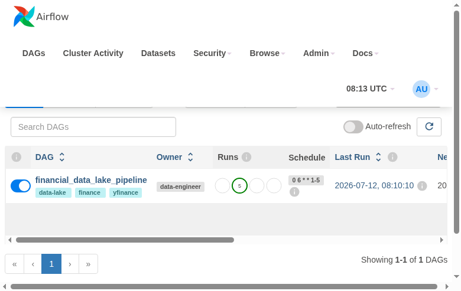
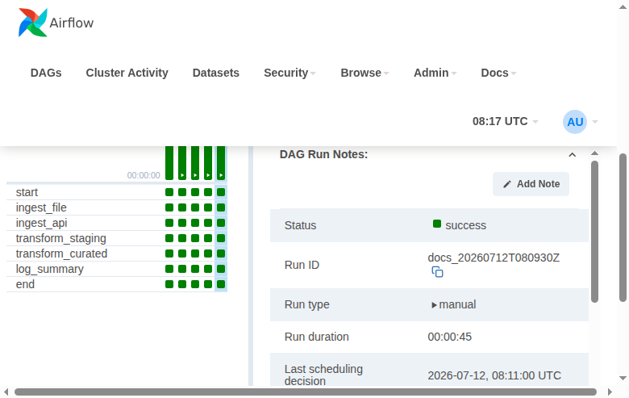
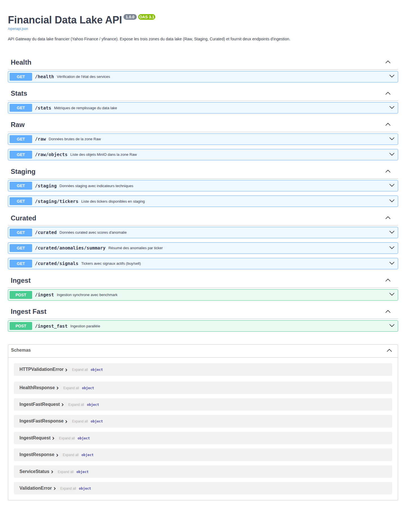
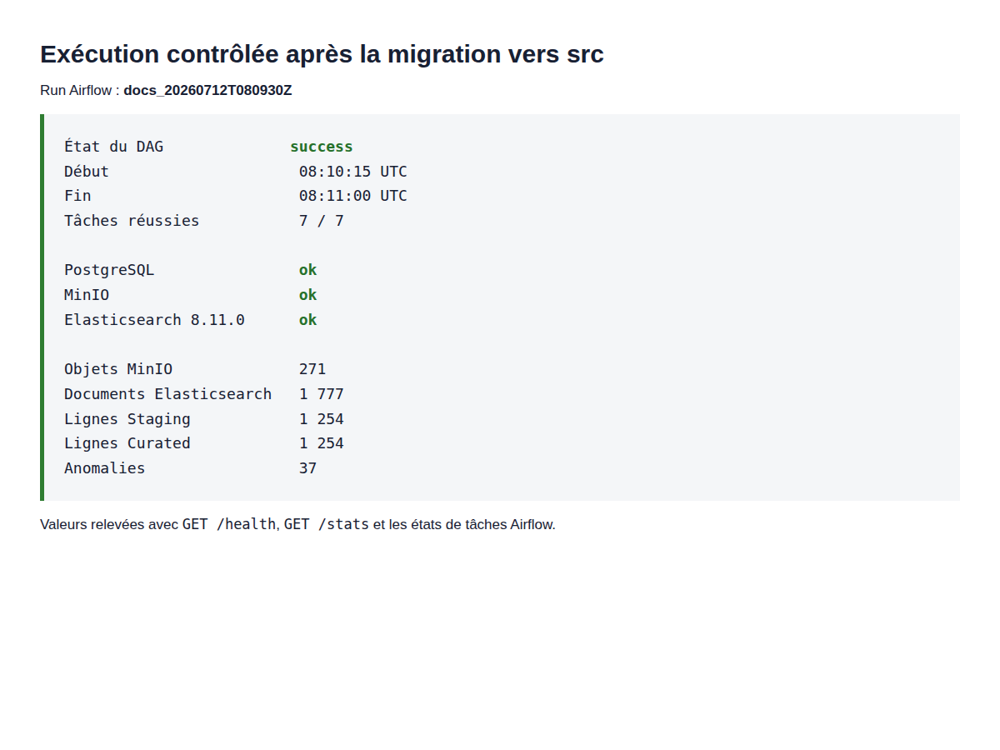
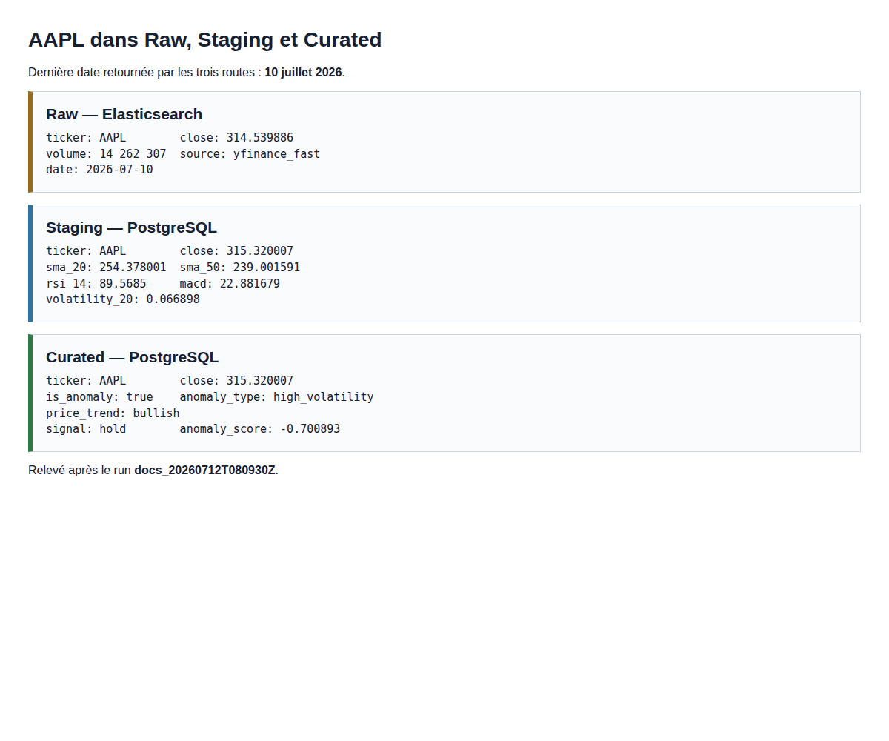

# Rapport technique

## Projet

Nous avons construit un data lake qui traite des cours financiers journaliers. Le dépôt contient une source fichier, une source API, trois zones de données, une orchestration Airflow et une API FastAPI.

Ce rapport décrit uniquement le code exécuté dans le dépôt. Nous avons reconstruit la stack après le passage du code métier sous `src`, lancé les tests, déclenché un nouveau run Airflow et relevé les réponses des routes avant de rédiger cette version.

## Sources de données

La source fichier est `data/finance_dataset.csv`. Le pipeline vérifie les colonnes `ticker`, `date`, `open`, `high`, `low`, `close` et `volume` avant de traiter le contenu.

La source API est Yahoo Finance. Le code utilise `yfinance` pour récupérer les cours des tickers définis dans `src/financial_data_lake/config/settings.py`.

## Environnement Python

Le fichier `pyproject.toml` déclare Python 3.11 ou 3.12 et les dépendances utilisées par le projet. `uv.lock` conserve les versions exactes résolues.

Nous avons recréé l'environnement avec :

```bash
uv sync --frozen
```

uv a utilisé Python 3.11.15 et a installé le package local `financial-data-lake`. La commande suivante a ensuite réussi :

```bash
uv run pytest -q
```

Résultat : 13 tests réussis.

## Package sous src

Le code réutilisable se trouve maintenant dans `src/financial_data_lake`.

```text
src/financial_data_lake/
  config/settings.py
  ingestion/ingest_file.py
  ingestion/ingest_api.py
  transformation/staging/transform_staging.py
  transformation/curated/transform_curated.py
```

L'API importe ce package depuis `/app/src`. Airflow monte `./src` dans `/opt/airflow/src` et ajoute ce dossier à `PYTHONPATH`. Les tests installent le package avec uv.

Cette organisation sépare les points d'entrée du code métier. `api/main.py` démarre l'application, le fichier DAG démarre les tâches et les fonctions de traitement restent importables depuis le package.

## Architecture exécutée

Docker Compose lance cinq composants principaux sur le réseau `datalake-net`.

```text
finance_dataset.csv ---- ingest_file ----|
                                         |--> MinIO
Yahoo Finance ---------- ingest_api -----|--> Elasticsearch
                                                |
                                                v
                                      staging_ohlcv
                                         PostgreSQL
                                                |
                                                v
                                      curated_analysis
                                         PostgreSQL
                                                |
                                                v
                                            FastAPI
```

PostgreSQL contient les tables `staging_ohlcv`, `curated_analysis` et `ingestion_logs`. Airflow utilise la même instance pour sa base interne.

MinIO conserve les objets CSV et JSON de la zone Raw. Elasticsearch conserve les documents Raw interrogeables. PostgreSQL contient les lignes transformées.

## Zone Raw

### Ingestion fichier

`src/financial_data_lake/ingestion/ingest_file.py` charge le CSV et normalise les noms de colonnes.

Le code :

1. convertit les tickers en majuscules ;
2. convertit les dates au format attendu ;
3. convertit les colonnes numériques ;
4. enlève les lignes sans ticker, date ou clôture ;
5. garde la dernière ligne en cas de doublon ;
6. écrit un objet CSV par ticker dans MinIO ;
7. indexe chaque ligne dans Elasticsearch.

L'identifiant Elasticsearch suit la forme `source_ticker_date`. Une nouvelle ingestion de la même ligne remplace le document existant.

### Ingestion API

`src/financial_data_lake/ingestion/ingest_api.py` télécharge les cours Yahoo Finance. Le JSON complet est écrit dans le bucket `raw-api-data`. Les lignes OHLCV sont ensuite indexées dans `raw_financial_events`.

Le DAG demande deux jours de recul. Les routes manuelles acceptent une période comme `5d`.

## Zone Staging

`src/financial_data_lake/transformation/staging/transform_staging.py` relit les documents Raw d'un ticker depuis Elasticsearch. Le code trie les dates, enlève les doublons et calcule les indicateurs sur la série obtenue.

Les colonnes calculées sont :

- `sma_20` et `sma_50` ;
- `ema_12` et `ema_26` ;
- `rsi_14` ;
- `macd` et `macd_signal` ;
- `bollinger_upper` et `bollinger_lower` ;
- `daily_return` ;
- `volatility_20`.

Les valeurs absentes ou infinies sont converties en `NULL` avant l'écriture. L'upsert PostgreSQL utilise `(ticker, date)`.

## Zone Curated

`src/financial_data_lake/transformation/curated/transform_curated.py` lit les données Staging par ticker.

Isolation Forest travaille sur le rendement journalier, la volatilité sur 20 périodes, le z-score du volume et le RSI 14. Le modèle utilise 100 arbres, `random_state=42` et une contamination de 5 %. Il ne s'exécute pas sous 30 lignes.

Les règles donnent les types suivants :

- `flash_crash` sous -5 % de rendement ;
- `price_spike` au-dessus de 5 % ;
- `volume_spike` si le z-score absolu du volume dépasse 3 ;
- `high_volatility` si la volatilité dépasse 4 % ;
- `unknown_anomaly` pour un autre point isolé.

La tendance vaut `bullish` si le cours est au-dessus de la SMA 20, elle-même au-dessus de la SMA 50. La condition inverse donne `bearish`. Les autres lignes sont `neutral`.

Le signal vaut `buy` lorsque le RSI est inférieur à 30 et que le MACD dépasse sa ligne de signal. Il vaut `sell` lorsque le RSI dépasse 70 et que le MACD est sous sa ligne de signal. Les autres cas donnent `hold`.

## Orchestration Airflow

Le DAG `financial_data_lake_pipeline` est planifié avec `0 6 * * 1-5`.

```text
start
  |-- ingest_file --|
  |                 |--> transform_staging --> transform_curated --> log_summary --> end
  |-- ingest_api  --|
```

Les deux ingestions s'exécutent en parallèle. Elles placent les tickers réussis dans XCom. Staging traite ces tickers, puis Curated traite les tickers réussis dans Staging.

Les imports du package sont placés dans les fonctions de tâche. Airflow lit régulièrement le fichier pour découvrir le DAG. Les dépendances métier sont donc chargées quand la tâche démarre et pas pendant chaque lecture du fichier. Le commentaire dans le DAG explique ce choix.



La capture a été prise après la reconstruction des conteneurs. Airflow charge le DAG depuis le fichier monté. La commande `airflow dags list-import-errors` ne retourne aucune erreur.



Le run `docs_20260712T080930Z` a commencé à 08:10:15 UTC et s'est terminé à 08:11:00 UTC. Les tâches `start`, `ingest_file`, `ingest_api`, `transform_staging`, `transform_curated`, `log_summary` et `end` ont toutes terminé avec `success`.

## API FastAPI



La capture Swagger montre les groupes réellement enregistrés dans `api/main.py`.

`GET /health` teste les connexions PostgreSQL, MinIO et Elasticsearch.

`GET /stats` compte les objets MinIO, les documents Elasticsearch, les lignes Staging, les lignes Curated et les anomalies.

`GET /raw` lit Elasticsearch. `GET /raw/objects` liste les objets MinIO.

`GET /staging` et `GET /staging/tickers` lisent PostgreSQL.

`GET /curated`, `GET /curated/anomalies/summary` et `GET /curated/signals` lisent les résultats Curated.

`POST /ingest` exécute les étapes séquentiellement. `POST /ingest_fast` utilise huit threads pour les téléchargements et les envois MinIO, une écriture groupée Elasticsearch et `execute_values` pour PostgreSQL.

## Exécution contrôlée

Nous avons exécuté :

```bash
sudo docker compose up -d --build --force-recreate
sudo docker compose exec -T airflow-scheduler \
  airflow dags trigger financial_data_lake_pipeline \
  --run-id docs_20260712T080930Z
```

Après le succès du run, `GET /health` a retourné :

```text
overall          ok
PostgreSQL       ok
MinIO            ok
Elasticsearch    ok, version 8.11.0
```

`GET /stats` a retourné :

```text
Objets MinIO fichier      201
Objets MinIO API           70
Objets MinIO totaux       271
Documents Elasticsearch  1777
Lignes Staging            1254
Lignes Curated            1254
Anomalies                   37
```



MinIO augmente à chaque exécution parce que les objets API sont horodatés. Elasticsearch utilise des identifiants stables. Le nombre de documents n'augmente donc pas de la même façon.

Staging et Curated contiennent chacun 1 254 lignes. Curated enrichit les lignes Staging au lieu de les filtrer. Les 37 anomalies viennent du modèle exécuté par ticker. Le taux global n'est pas exactement 5 %, notamment parce que le modèle ne démarre pas pour les petits historiques.

## Lecture d'une ligne AAPL



Les routes `/raw`, `/staging` et `/curated` ont retourné une ligne AAPL datée du 10 juillet 2026.

Raw retourne un cours de clôture de 314,539886 et un volume de 14 262 307 pour la source `yfinance_fast`.

Staging retourne un cours de clôture de 315,320007, une SMA 20 de 254,378001, une SMA 50 de 239,001591, un RSI de 89,5685 et une volatilité de 0,066898.

Curated marque cette ligne comme anomalie `high_volatility`. La tendance vaut `bullish`, le signal vaut `hold` et le score d'anomalie vaut -0,700893.

Raw et Staging peuvent présenter une valeur différente pour une même date. Elasticsearch peut contenir plusieurs sources. Staging trie puis déduplique avec la clé `(ticker, date)` avant l'upsert PostgreSQL.

## Tests

La commande finale est :

```bash
uv run pytest -q
```

Résultat : 13 tests réussis.

Les tests vérifient :

- le RSI ;
- les règles de tendance et de signal ;
- la préparation Staging ;
- les identifiants Elasticsearch ;
- la validation du CSV ;
- le calcul du benchmark ;
- la présence du package et des modules sous `src`.

Nous avons aussi validé Docker Compose, importé le package depuis le conteneur API et contrôlé les erreurs d'import du DAG.

## Limites constatées

Yahoo Finance est externe au projet. La durée et le nombre de lignes disponibles dépendent de sa réponse.

Le RSI 14 demande quatorze observations. Une ingestion courte ne suffit pas toujours pour remplir cette colonne.

Isolation Forest ne démarre pas sous 30 lignes. La contamination de 5 % est un paramètre du modèle. Une anomalie indique un point isolé selon les variables utilisées, pas une erreur certaine.

Les signaux n'ont pas été évalués comme stratégie financière.

Les identifiants présents dans Docker Compose sont réservés au lancement local du projet.

## Reproduction

```bash
uv sync --frozen
uv run pytest -q
docker compose up -d --build
curl http://localhost:8000/health
curl http://localhost:8000/stats
```

Déclenchement du DAG :

```bash
docker compose exec airflow-scheduler \
  airflow dags trigger financial_data_lake_pipeline
```

Régénération des PDF :

```bash
uv run python scripts/generate_pdf_deliverables.py
```
